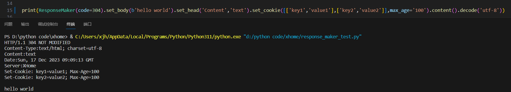

# 技术文档
github:https://github.com/ndce1041/secondhandwebsite
JNU_id = 2021104247

## 后端框架相关

### 1. 后端框架整体设计思路


主循环所在文件`xhome.py`
最终目标为创造一个轻量级，强拓展性，高性能高并发的高通用性后端框架

使用python `selectors`库来搭建套接字池 主要作用是兼容windows和linux的差异,windows环境会自动选择`poll / select` 方式托管套接字,而linux环境会选择更高效的`epoll`管理套接字,此外windows环境文件描述符不能正常使用,需要直接传入套接字

#### 主要运行逻辑：
（1）.加载日志模块,读取配置文件`xweb.conf`初始化原始socket后,记录其文件描述符并投入套接字队列`selector`中设置对应回调等待响应
（2）.同时注册路由`url`在路由中写入`默认无效路径回调函数`和`默认静态资源回调函数`。

（3）.`selector`套接字池中的套接字接收到前端请求进入可读状态后交由`recv_data`接收数据，首先对比文件描述符，如果为原始套接字则表示将接收的为新套接字，接收后投入`selector`中；如果不是表示有可读的前端请求。
（4）.前端请求为二进制数据，每次接收1024字节数据，循环接收数据直至读空（读空会报一个错，如果断开连接了会读取到0）。
（5）.接收完毕交给`AnalysisRequest`对象解析，首先解析是否为http请求，如果是则返回请求路径,交给路由`url`寻找对应地址的回调函数，如果找到则将解析后的请求传入，否则执行默认无效路径回调函数。
（6）.请求完成后直接断开连接，完成此次http请求。进入下一个循环

##### 注意事项：
* 使用Server()实例化服务器对象
* 使用Server.loop()开启服务器
* 一个应用应该具有至少一个回调函数，否则只会返回404。


一个最小系统应具有如下内容
```python
import xhome as xh
import response_maker as rm

server = xh.Server()

def index(request,key,rest):
    return rm.ResponseMaker().set_body("Hello World".encode("utf-8"))

server.url.add("/",index)
server.loop()
```


### 2. 路由相关

路由系统的设计思路为高可读性，强拓展性，请求连接可以通过更深的路径传递参数
路由组件对应文件 `url_manage.py` 创建对象后执行 `url.add(path,func)` 即可创建对应节点，回调函数需要满足一定格式：

```python
def func(request,key,rest=[]):
    return response: bytes
```


其中`request`包含请求的所有信息；`key`中包含套接字本身，用来给回调函数更高级自由度，如果函数返回`False`则内核将不再管理此套接字，交由函数自行处理；`rest`为寻找到最深处回调后剩余的路径参数，例如只申请了`/index`节点，那么当请求为`/index/2/3`时`rest=[2,3]`;`response` 对象为构建响应的工具对象。

路由对象本身是在维护一个树状字典，每当添加路径时根据路径建立路径，通过递归将建立的路径更新到树状字典中。

##### 路由提供的API：

* 注意：后端路由位于`Server.url`
* `__init__(unfound=func)` 
* `.get(url)` 通过传入的路径获取对应回调
* `.add(url,func)` 生成路由节点
* `server.unfound` 该参数储存了unfound回调，为未找到可用回调时的默认回调函数 如果不设置将使用内部默认回调，修改此项可变更为自定义的回调函数
* 路由由内核自动创建，应用中一般只使用内核中的路由`server.url.add(url,func)`

### 3. 中间件

依靠python自带的装饰器语法编写，目前可用功能为在Content-Type确定时主动解析请求负载`body`，和验证`cookie`自动拦截非法请求

### 4. 默认静态回调

设计为忠诚的返回对应文件,匹配不同文件对应的`Content-Type`,可以时进行压缩处理

对应文件`static_resources_manager.py`

初始化时读取配置文件中`static_path`条目，初始化时自动注册到配置文件`static_url`条目对应路径，当请求为对应静态路径时，剩余参数（子文件路径）会传入函数`rest`参数中，如果文件为文本类型会自动调用`gzip`压缩。如果没有对应文件会返回`404`

例如`static_url="/static"`时，请求为`/static/img/a.css`,则根据路由规则`rest=["img","a.css"]`。随后此回调就会寻找`static_path`子目录下的`/img/a.css`文件，将此文件进行`gzip`压缩后添加请求头`'Content-Encoding = gzip'`并返回发送。

### 5. 响应构建工具

设计思路为简单易用可以在一行内完成响应构建，实现常用功能
对应文件`response_maker.py`提供链式调用快速生成响应。


##### `response`对象提供API：
* `__init__(code=200)` 设置状态码（默认200） 并设置基础字段 
* `set_body(byte) `可以设置body内容,需要是byte类型数据，为了兼容其他文件的传输
* `set_cookie(key,value)` 可以设置响应头`set_cookie`字段，可多次设置，也可以传入列表，字典等，另外有参数控制cookie行为
* `set_head(key,value)` 设置响应头其他字段
* `quick_jump(url)` 返回一段用于跳转的网页
* `content()` 只在内核内调用，组装网页并返回二进制数据

所有开放的API都支持链式调用

### 6. 配置文件

包含配置端口，ip，静态文件地址，网页协议等
由`read_config.py`文件读取，import后会将其中参数读出保存为全局参数

### 7. 日志功能

根据日期命名文件保存在根目录当中，记录内核活动，请求处理情况
应用中可以通过

* `server.DEBUG()`
* `server.INFO()`
* `server.WARNING()`
* `server.ERROR()`

借用内核日志功能写入日志
设置`sever.LOG = False` 可以将日志等级提高到WARNING (默认为True，等级为DEBUGE)

日志格式如下
```python
    logging.basicConfig(level=logging.DEBUG,
                        format='%(levelname)s-%(asctime)s - %(filename)s[line:%(lineno)d]:%(message)s\r\n',
                        filename='%s.txt' % time.strftime('%Y-%m-%d'),
                        filemode='w',
                        encoding='utf-8')
```


### 8. 请求解析

设计思路为：只进行简单的请求头分解，但提供进阶解析函数，在只要简单检查请求头时提供更快的速度，又保证需要复杂数据时的便捷性
对应文件`analysis_request.py`

其中提供了对请求头的全面解析，会将head中所有键值对储存，重载了中括号使读取更方便。部分值为列表或字典字符串形式的键值对需要用专门函数读取。

提供的接口包括：
* `value = request[key]` 重载了`__getter__` 方便读取
* `request[key] = value` 重载了 `__setter__` 方便写入更改
* `request.cookie()` 用来进一步解析cookie数据并返回，多次运行不会重复解析
* `request.accept()` 用来解析accept条目（通常是一大串附带附加参数的多个值组成的字符串）
* `print(request)` 重载了`__str__` 单纯方便debug

注意：现在还不能根据Content-Type自动处理负载，需要中间件进行处理


## 二手交易网站设计思路

### 1. 数据库结构

数据库分为三个表 ， `user` `goods` `orders` 分别对应用户信息，商品信息，订单信息。

使用python自带的嵌入式数据库sqlite3，数据库生成语句在`setDB.py`中，数据库名为`main.db`

#### 用户
用户表
* `uid` 存储用户账户
* `passwoed` 密码 
* `name` 昵称
* `money` 持有金额。
* `token`来储存用户通行证用于用户每一步操作前的检查，具体更新方法参阅 `2.登陆`。
* `time`存储用户最后一次登陆时间。

#### 商品
* `uid` 商品持有者id 存在外键约束，必须是`user`表中存在的
* `gid` 商品自身的id
* `price` 价格
* `name`  商品名
* `description`  描述文本
* `image` 展示图片
* `state` 商品状态  存在写入检查 0，1，2
* `releasetime` 发布时间  默认datetime("now","localtime")

#### 订单
* `oid` 订单自身id
* `gid` 商品id  存在外键约束
* `uid` 商品购买者id 存在外键约束
* `price` 商品价格
* `state` 订单状态
* `time` 订单生成时间 默认datetime("now","localtime")

### 2. 登陆操作

相关连接有`/login` 和 `/logincheck`
相关中间件为`User_Check`

首次访问网站的用户由于cookie中缺少`token`会被中间件拦截跳转到`/login`界面。用户需要输入账号和密码。

为了防止密码明文传输,采用哈希加盐的方法:
1. 网页端会使用js随机生成`salt`，与密码拼接后经过哈希生成哈希值。
2. `uid`，`密码哈希`，`salt`会以post方式传回服务器`/logincheck`
3. 后端用传回的`salt`值与数据库内储存的密码再次组合计算哈希并进行比对，如果成功，则以哈希值作为`token`，储存在前端cookie中以及数据库对应用户token词条中。
4. 此后访问其他链接时中间件`User_Check`都会检查cookie中`uid`和`token`是否对应,否则进行拦截。

cookie中`token`设置为30天过期，全域有效

### 3. 商品展示页面
相关路径`/viewpage`

网页模板使用`jinja`库进行生成，每页的最大显示数量限制为6个，通过get方法设置`url?page=n` 来翻页。模板引擎将根据cookie中用户信息和在售商品数据在后端将信息填入网页返回给前端。

点击购买按钮后会跳转到`/order`地址创建订单详情见`5. 订单处理界面`

```html
        <!-- 模板块 -->
        
        
        <div class="bg-white shadow-md rounded-md p-4">
            <div class="image-placeholder mb-4">
                
            </div>
            <p class="text-gray-700 font-bold">{{ item.name }}</p>
            <p class="text-blue-500">{{ item.money }}花西币</p>
            <p class="text-gray-700 overflow-auto h-32">{{ item.text }}</p>
            <form action="/order" method="post">
                <input type="hidden" name="gid" value="{{ item.gid }}">
                <button type="submit" class="bg-blue-500 hover:bg-blue-700 text-white font-bold py-2 px-4 rounded">购买</button>
            </form>
        </div>

        
```

### 4. 出售商品页面
相关路径`/sellpage` `/sellcommit`

其页面实际是一个表单，选择要上传的图片后会通过js在指定位置显示预览图，填入所有信息后点击提交按钮即可上传。

图片显示框"id = img"绑定了点击事件`handleFileSelect` 被点击后会模拟点击隐藏的`input`标签，选择完图片后将图片替换自身`src`达到预览效果

由于含有二进制文件，因此采用 `multipart/form-data` 格式数据，后端中间件`Form_Data`专门用于处理此类型

### 5. 订单处理界面
相关路径`/orderpage`, `/ordersearch`, `/orderconfirm`, `/ordercancel` ,`/order`

订单的重要性在于这是每一宗交易的唯一凭证，需要做到易查且全面
订单的处理相比于其他信息处理不同点在于需要防止同一个货物的重复待处理订单的出现，在此单线程顺序执行的程序中只需要每次操作时核查该订单的有效性和唯一性即可。

在商品浏览界面`/viewpage`点击商品下方的购买按钮即可跳转到`/order`。后端`order` 回调用于生成订单，根据前端传回的gid,cookie内的uid创建订单,首先检查商品状态,检查订单表是否有相同gid商品且状态为0未完成状态,防止商品被重复购买;随后读取商品信息,修改商品状态为1,表示商品以售出,随后生成订单生成oid,初始状态为0.

* `/orderpage` 回调用于读取数据库中与用户uid相符的所有订单并拼接网页返回,订单分3种状态, 0:未完成 1:已完成 2:被取消  订单oid会储存到左侧标签栏中标签的oid属性内,通过js给所有此类标签添加点击事件,被点击时会取消同类的高亮并且为自己添加高亮,同时调用`ajax`函数向后端返回一个`application/json`类型的请求,后端读取其中的oid属性和cookie中的uid读取对应的数据再通过json格式返回,被前端接收后将信息更新到展示区域. 订单将按时间顺序排列最新订单将始终位于顶端,最顶端的订单默认直接展示.状态为0的订单将显示 确认 取消 按钮给用户选择,其余状态订单将不显示按钮.

* `/ordersearch` 为`orderpage`页面调用`ajax`时的请求地址,用来处理和返回订单信息

* `/orderconfirm` 用户点击`confirm` 按钮时调用,会通过`ajax`形式向后端请求,后端收到亲求后首先确认订单信息和商品信息,确认uid,gid,oid,和价格是否正确.如果通过检查则将订单状态`state`设为1;对卖家扣费以及卖家获得收入.

* `/ordercancel` 用户点击`cancel` 按钮后调用,调用原理同上,后端首先会确认订单存在,随后将订单状态设为2（被取消）,将商品状态重新设置为0（在售状态）.


### 6.整体页面风格设计

页面全部位于`./static/html`下，全部使用css框架`tailwindCSS`。
引用网上的介绍

Tailwind CSS 是一个高度可定制的、工具类优先的 CSS 框架，它有以下几个特点：

1. **工具类优先**：Tailwind 提供了大量的工具类，你可以直接在 HTML 中使用这些类来创建用户界面。这种方法可以让你更快地构建用户界面，而不需要在 CSS 文件中写大量的样式规则。

2. **高度可定制**：Tailwind 的配置文件允许你自定义几乎所有的样式，包括颜色、字体、间距等。这意味着你可以根据你的设计系统来定制 Tailwind，而不需要覆盖不需要的样式。

3. **响应式设计**：Tailwind 提供了一种简单的方法来创建响应式设计。你只需要在工具类前面添加一个断点前缀，就可以在不同的屏幕尺寸上应用不同的样式。

4. **与现代工具集成**：Tailwind 可以与许多现代前端工具（如 PostCSS、PurgeCSS、Webpack 等）无缝集成，这可以帮助你优化你的项目。

5. **组件友好**：虽然 Tailwind 是工具类优先的，但它也支持使用 @apply 指令来创建可重用的组件。这意味着你可以在工具类和组件之间找到一个平衡，以适应你的项目需求。

6. **实用性原则**：Tailwind 遵循实用性原则，提供了大量实用的工具类，而不是预设的组件。这意味着你有更大的灵活性来创建独特的设计，而不是被框架的限制所束缚。

外观设计思路为实现响应式布局，各个模块独立分离.

*html代码初稿由GPT-4识别手绘图像生成*


